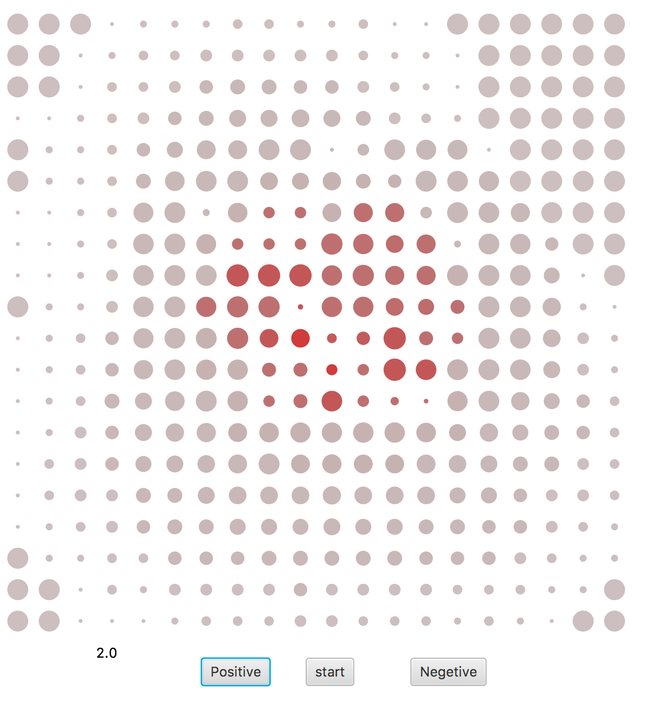

# IF-Neurons

This is a naive simulation of the reduced hodgkin huxely model (integrated and Fire) neurons, in a square environment, with each neuron having synapses with a radius near it.
the size of each neuron coresponds to the charge, and the color coresponds to the spike rate (frequency).

simply push start, then adjust the Injection rate by Positive and Negative buttons, and if you push anywhere on the screen the amount of the injection rate would be injected to a radis 3x3 of neurons around it.

Aria Halavati
Sharif University of Technology
